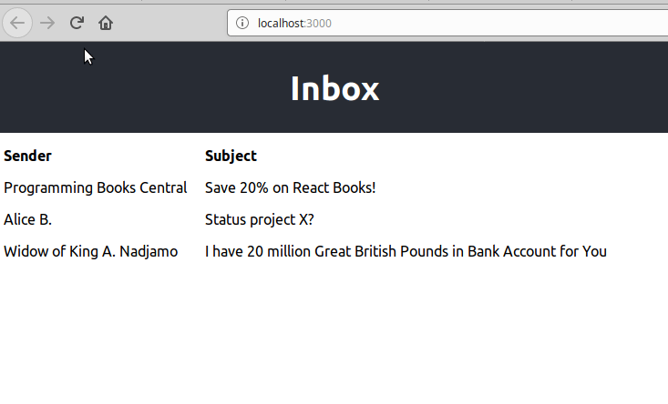
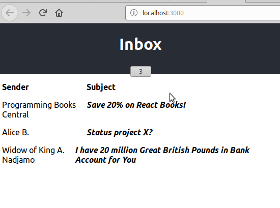

# React Practice

Opdrachten om te oefenen met met React componenten, interactie, en state.


### 1. Hoe vang je interactie op een element?

Klik op de button, er verschijnt een alert.


### 2. Gebruik interactie op een element om een ander element aan te passen

In plaats van alleen eenmalig een alert tonen, verander nu een ander element in de DOM.


### 3. Toggle state

Maak het vorige voorbeeld zodat je met een volgende klik weer terug naar de beginstatus kan gaan.
In het voorbeeld verander ik de tekst en klassenaam van de button zelf, en ik toon een tekst als de status 'liked' is. Hint: als je er niet in één keer uitkomt, bouw dit één stapje tegelijk!


### 4. Deel state tussen componenten.

Het verschil met oefening 3 is dat we nu de interactie tussen losse componenten willen laten plaatsvinden.

In het voorbeeld heb ik een header met login-knop en een 'content' gedeelte. In het echt zouden deze allebei waarschijnlijk ingewikkeld genoeg zijn dat ze ook echt hun eigen component zouden verdienen, dus heb ik ze als twee componenten geimplementeerd die ik in `App.js` importeer en gebruik:

```javascript
import HeaderBar from './ex04-headerbar.js';
import Content from './ex04-content';
```

Waar het in deze oefening om gaat is dat je een klik binnen de Header Bar component kan registreren en ervoor zorgen dat iets in een ander component verandert. Hint: 'lift state up'.


### 5. Render een lijst van elementen

Gebruik het volgende array in je state en render het als lijst:

```javascript
messages: [
  { read: false, sender: "Programming Books Central", subject: "Save 20% on React Books!"},
  { read: false, sender: "Alice B.", subject: "Status project X?"},
  { read: false, sender: "Widow of King A. Nadjamo", subject: "I have 20 million Great British Pounds in Bank Account for You"}
]
```


### 6. Haal data van een server en render het
Pas oefening 5 aan zodat je de data ophaalt van dit url:

```
https://raw.githubusercontent.com/hpfast/react-practice/master/messages.json
```

Hint: kijk naar 'Lifecycle Methods'.

Het is met React vrij eenvoudig om een 'loading' indicator te tonen totdat de data is geladen:



### 7. Two-way state binding, meerdere views op de state
Voeg een 'unread messages' indicator toe aan de inbox. Het toont het aantal ongelezen berichten. Als je op een bericht klikt, vermindert het getal. Je kan ook in 1 keer alles ongelezen maken door op het icoontje te klikken.


